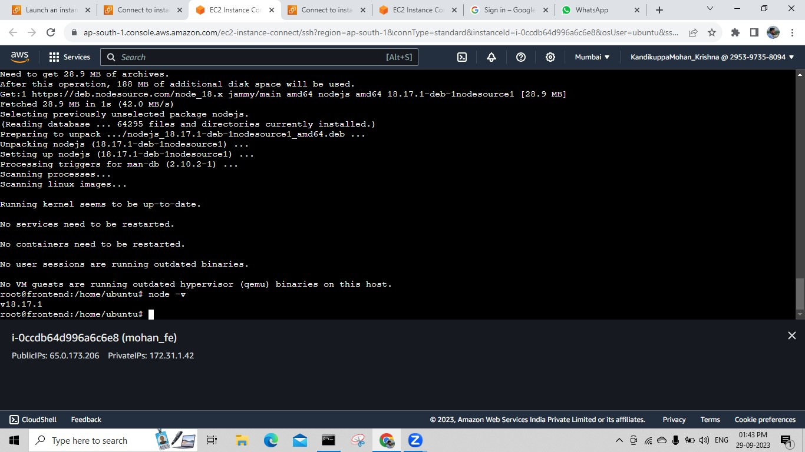
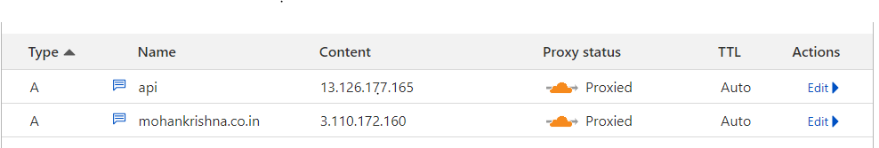
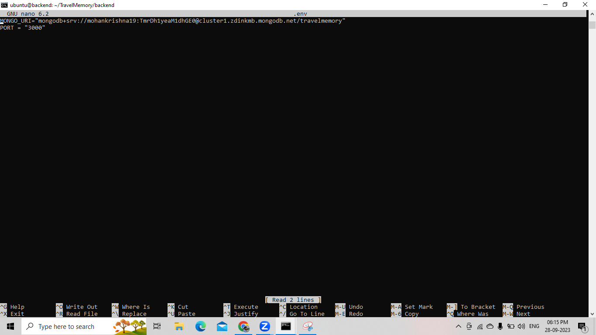

# Travel Memory

# How to Deploy and Scale a MERN Application (Travel Memory Application) on AWS.

The main objective of this project is to deploy and scale a MERN (MongoDB, Express, React, Node.js) application on AWS. Here's a step-by-step guide to help you get started.

### 1. [Configuring Mongo DB](#configuring-mongo-db)
### 2. [Creating Instances](#creating-instances)
### 3. [Installing prerequisites for backend and frontend](#installing-prerequisites-for-backend-and-frontend)
### 4. [Configuring in Cloudflare](#configuring-in-cloudflare)
### 5. [Configuring Backend](#configuring-backend)
### 6. [Configuring Frontend](#configuring-frontend)
### 7. [Scaling the Application Using Load Balancer](#scaling-the-application-using-load-balancer)
### 8. [Creating an Image for frontend and backend](#creating-an-image-for-frontend-and-backend)
### 9. [Configuring Target Groups](#configuring-target-groups)
### 10. [Configuring Load Balancer](#configuring-load-balancer)
### 11. [Testing the Load Balancer Configuration](#testing-the-load-balancer-configuration)
## Configuring Mongo DB

1. Need to open the cloud Mongo DB website and create a new cluster. For a free account, we have the option to create one free cluster.
2. To create a cluster, we need to click on Create and select Shared, then select Cluster Details add the name of the cluster, and click on Create a cluster.
3. Click on the cluster name and click on Connect. A tab will open, Click on compass, and select I have MongoDB compass installed, Copy the connection string link and paste the same link in the backend in the .env file as shown in the backend configuration.

## Creating Instances

1. Launch two instances with the same security group and key pair. Enter "2" under "Number of Instances" and click on "Launch Instances".


2. Connect to the instances.

## Installing prerequisites for backend and frontend
1. We need to perform the same steps in backend and frontend. In the below screenshots, I've performed in the backend.
2. Install node js v18 which is the stable version by this command
    ```
   curl -s https://deb.nodesource.com/setup_18.x | sudo bash

    ```.png>)


    ```
    sudo apt install nodejs -y
    ```
   
    ```
    node -v  # to check the version of node js
    ```



## Configuring in Cloudflare
1. Since we have backend and frontend public IP addresses, we need to configure the same in Cloudflare for an additional layer of protection as well as to register our domain names to our IP addresses (frontend and backend)


## Configuring Backend

1. We need to open the EC2 instance and clone the Git repo. We will go to the repo and open the backend.


```
sudo git clone https://github.com/UnpredictablePrashant/TravelMemory.git
```
.png>)

```
cd /home/ubuntu/TravelMemory/backend/
```
2. Create an env file using `sudo nano .env` and insert the below content. Then install npm which will install all the relevant dependencies where this application is required. Then we need to start the backend whether the dependencies are installed or not.
```
MONGO_URI='mongodb+srv://mohankrishna19:<password>@travelmemory.3a09n5s.mongodb.net/travelmemory'
PORT=3000
```

```
sudo npm install
```
```
sudo node index.js
```

3. So far the application is running on port 3000. We will need to do the reverse proxy so that the traffic  from the backend will be routed to port 80. We can achieve this by doing reverse proxy.

4. Install Nginx reverse proxy using `sudo apt install nginx` and check its status using `sudo systemctl status nginx`.

5. Create a new file to set up a reverse proxy using `sudo nano /etc/nginx/sites-available/mern-project`.
6. Add the following code to the file:

```
server {
    listen 80;
    server_name api.mohankrishna.co.in;
    location / {
        proxy_pass http://<backend_server_ip>:3000;
    }
}
```

7. Save the file and exit the text editor.
8. Enable the Nginx configuration using `sudo ln -s /etc/nginx/sites-available/mern-project /etc/nginx/sites-enabled/`.
9. Check for syntax errors using `sudo nginx -t`.
10. Restart Nginx using `sudo systemctl restart nginx`.


## Configuring Frontend

1. Log in to the frontend server and install the following dependencies:

```
sudo apt-get update
curl -s https://deb.nodesource.com/setup_18.x | sudo bash
sudo apt install nodejs -y
node -v
```

2. Clone the repo using `sudo git clone https://github.com/UnpredictablePrashant/TravelMemory`.
3. Navigate to the frontend directory using `sudo cd /home/ubuntu/frontend/`.
4. Install dependencies using `sudo npm install`.
5. Edit the `package.json` file by adding the following line:

```
scripts": {
    "start": "PORT=80 react-scripts start",
```
6. We also need to edit the url.js file by going to the src folder and giving the below command.
```
cd /home/ubuntu/TravelMemory/frontend/src
```
```
export const baseUrl = "<backendIP>:80"
```
7. Once it is done, we need to do the reverse proxy for the frontend as well. Below are the commands.
```
sudo nano /etc/nginx/sites-available/mern-project
```
```
server {
    listen 80;
    server_name mohankrishna.co.in;
    location / {
        proxy_pass http://<backend_server_ip>;
    }
}
```
8. Enable the Nginx configuration using `sudo ln -s /etc/nginx/sites-available/mern-project /etc/nginx/sites-enabled/`.
9. Check for syntax errors using `sudo nginx -t`.
10. Restart Nginx using `sudo systemctl restart nginx`.

11. Start the server using `sudo npm start`.


## Scaling the Application Using Load Balancer

1. Create an image from the action bar and select "Create Image".
2. Launch an instance from the image.
3. Launch the instance using AMI.
4. Perform the same tasks for the backend.
5. Connect to the instance and check whether the TravelMemory is visible or not.
6. If it is visible, we created an Image successfully.

## Creating an Image for frontend and backend

1. We need to create an image from the action bar and select create an image.

2. We need to go to the images and find the image we created. We will create an instance from the image.

3. We need to launch the Instance using AMI

4. Need to perform the same tasks for the backend
5. Once the Instances are launched, for confirmation, we need to connect to the instance and check whether the TravelMemory is visible or not. If it is visible, we created an Image successfully. In the below image, we see that the image is created successfully and launched successfully.

## Configuring Target Groups
1. Click on "Load Balancing" under EC2.
2. Click on "Target Groups" and follow the steps as shown in the screenshots.

3. We need to click on Target Groups and follow the steps as shown below in the screenshots.


4. Click on "Next" and select the frontend instances.

5. Click on "Include as Pending" below, then click on "Create Target Group".

6. We will be able to see the instances we selected in Target Groups. The status will be unused because we have not configured them with the load balancer. We will next configure the load balance using these instances.

7. Perform the same process for the backend.

8. Configure the load balancer using these instances.

## Configuring Load Balancer

1. Click on the "Load Balancer" above the Target Groups and click on Create load balancer.
2. Select "Application Load Balancer" for this application.
3. Choose at least 2 Availability Zones.
4. Keep the default configuration and click on "Create Load Balancer".
5. Perform the same process for the backend.
6. Take the load balancer DNS (you will find the same when you click on the respective load balancer) and configure it in Cloudflare.


## Testing the Load Balancer Configuration

1. Change the backend URL in `url.js`.
2. Test the load balancer configuration for the frontend and backend.


We've successfully deployed and scaled a MERN application on AWS. 🎉

